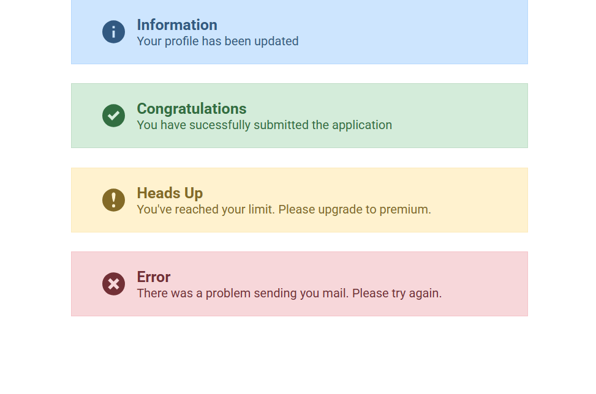
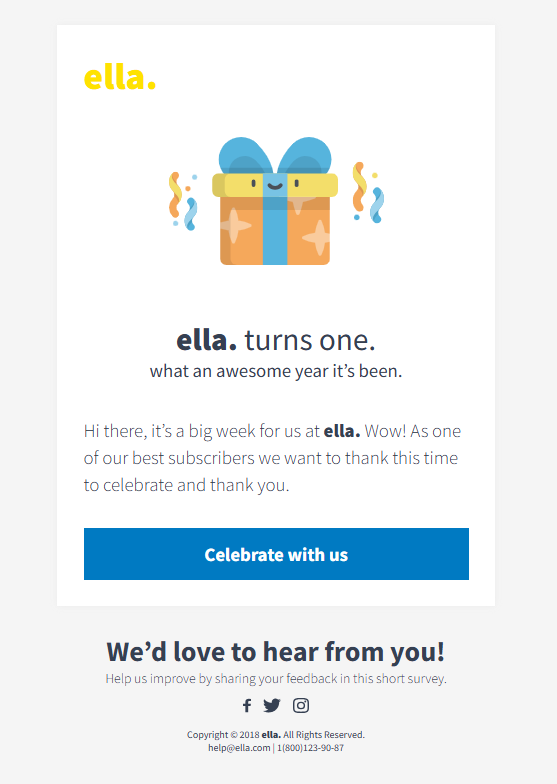
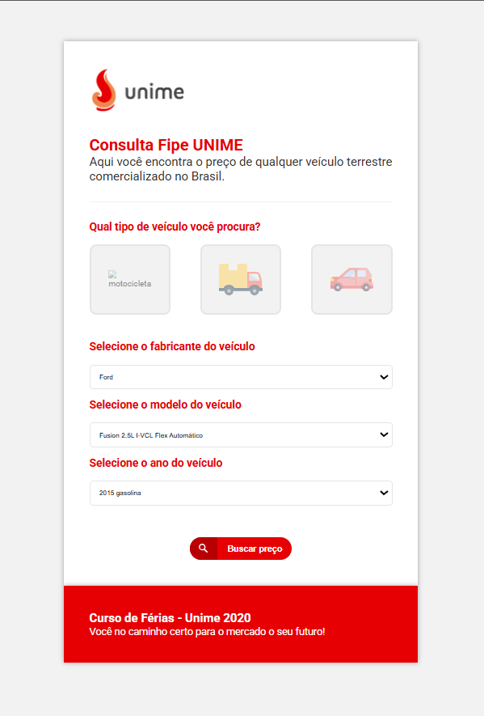
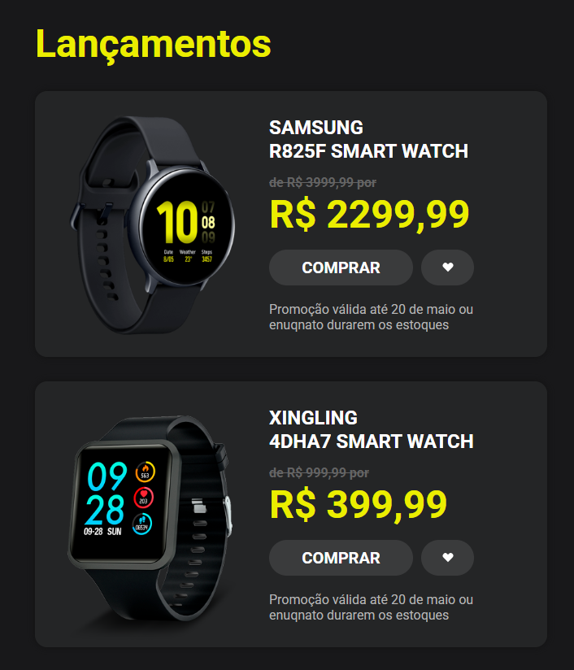

# Estudos CSS 🎨

Este repositório contém uma coleção de mini projetos desenvolvidos com foco em aprimorar habilidades em **CSS**. Cada projeto explora diferentes técnicas, estilos e desafios do mundo do front-end.

---

## 📁 Projetos

### 1. 🔔 Alerta

---

### 2. 🌸 Ella

---

### 3. 🚗 Fipe

---

### 4. 🛍️ Produtos

---

## 📌 Tecnologias Utilizadas

- HTML5
- CSS3
